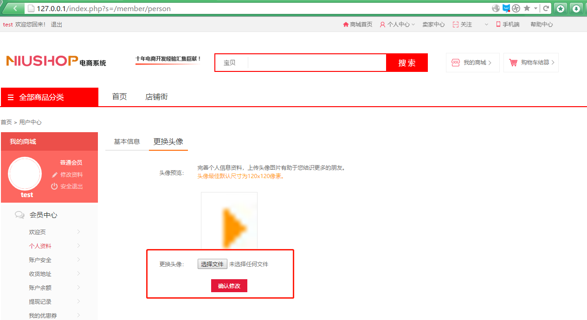

# File upload vulnerability in Niushop B2B2C Multi-business basic version V1.11 #

Description: NiuShop open source mall system is a set of PHP open source e-commerce system.File upload vulnerability in Niushop B2B2C Multi-business basic version V1.11 allows any remote member to upload .php files to the web server via a profile avatar field. This results in arbitrary code execution by requesting the .php file.


## 1.Technical Description: ##

locate in /application/shop/controller/member.php line:1044 to 1071


The member uploads the avatar, first determines whether the file Content-Type is the image file type, and then determines the file size, although it will be renamed, but the 1065th line intercepts the file name suffix for splicing, through which the webshell can be obtained.

## 2.PoC ##

Use the Google Chrome open this test site.download this version（```http://www.niushop.com.cn/download.html```) and build a test site.


And then we register a member：

> http://127.0.0.1/index.php?s=/login/register


Then we can login this member and change profile avatar.

> http://127.0.0.1/index.php?s=/member/person



Now we need to modify the upload data package as shown below


Finally，we get a php file and code had execution.Because it is a mall system, the member module must be open, and it is a very import issue.


